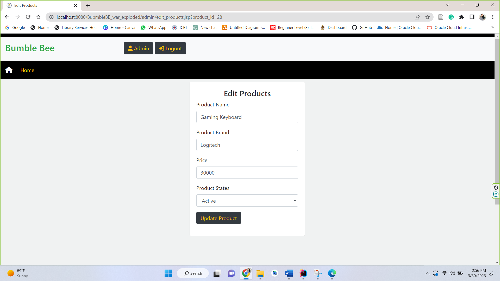

# BumbleBee 

* Jsp project created with MySql DB

* Bumble Bee - Buy First and Pay Later
* This is a simple admin panel web application created using jsp and servlets with my SQL database.
* Please create a database in your local machine by opening 'bumblebee_db.mwb' file in 'database template' folder from MySQL Workbench.
* I used 'MySQL' as the database server.

**Two users in this system**

## Customer

* Register
* Login
* View Products
* Add Cart
* Remove Product from the Cart
* Order
* View Order
* Edit Profile details
* Logout

## Admin

* Login
* View/Add/Update/Delete Products
* View/Add/Delete Brands
* View registered customers Orders
* Logout

## Bumble Bee Web Application - Interfaces

### Home page

### Recent Product Page

### New Products Page

### Old Products Page

### Login Page

### Registration Page

### Admin Home Page

### Admin Add Products Page

### Admin All Products Page

### Admin Edit Products

### Admin View Customer Orders

### Admin Add Brands

### Logout

### Customer Cart details and Order Process

